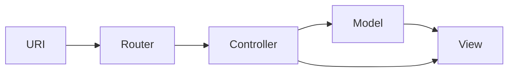

# PHPプログラミング勉強会（応用編）


**関連リンク**
1. [Paiza.IO](https://paiza.io/ja/projects/new?language=php)　[Webプログラミング演習](http://www-dx.ip.kyusan-u.ac.jp/rs/site/r06wp/)
1. [PHPマニュアル](https://www.php.net/manual/ja/index.php)　[とほほPHP入門](https://www.tohoho-web.com/php/index.html)　 [とほほBoostrap入門](https://www.tohoho-web.com/bootstrap5/index.html)
1. [GitHub Desktop](https://docs.github.com/ja/desktop)　[Composer](https://getcomposer.org/download/)

## １．PHP補足

1. `extract()`関数： 配列の要素を変数にインポートする

    ```php
    $array = ['id'=>23, 'ym'=>2408];
    extract($array);
    echo '$id = ', $id, ', $ym = ', $ym, PHP_EOL; // $id = 23, $ym = 2408
    ```

1. **三項演算子** `(条件式) ? (式1) : (式2)`

   ```php
   $grade = 87;
   $result = $grade >= 90 : 'S' : 'A以下';
   echo $result, PHP_EOL; // A以下
   ```

1. **Null合体演算子**`(式1) ?? (式2)`

   ```php
   $id = $_GET['id'] ?? : 0;
   
   // 以下の三項演算式と同じ
   $id = isset($_GET['id']) ? $_GET['id'] : 0;
   
   //以下のif文と同じ
   if (isset($_GET['id'])) {
       $id = $_GET['id'];
   }else {
       $id = 0;
   }
   ```

1. **比較演算子**`==, !=, ===, !==`

   ```php
   if ('01' == 01) {//型を問わずに値だけで同じかをチェック
       echo '==等しい', PHP_EOL;
   }
   if ('01' != 01) {
       echo '!=等しくない', PHP_EOL;
   }
   
   if ('01' === 01){//  型まで同じかをチェック
       echo '===等しい', PHP_EOL;
   }
   if ('01' !== 01){//型が同じではいため、等しくない
       echo '!==等しくない', PHP_EOL;
   }
   /**
   ==等しい
   !==等しくない
   */
   ```
   
1. `false`と評価される値：`0, 0.0, '0', "", [], null `

   ```php
   foreach ( [false, 0, 0.0, '0', 00, "", [], null] as $x){
       var_export($x);
       echo  "\t ", ($x)? 'true' : 'false', PHP_EOL;
   }
   /**
   false	 false
   0	 false
   0.0	 false
   '0'	 false
   0	 false # 00
   ''	 false
   array (    # []
   )	 false
   NULL	 false
   */
   ```

1. 変数をチェックに関する関数

   - `is_null($x)`：変数`$x`が `null` かどうか調べる。`$x`未定義ならエラー。
   - `isset($x)`：変数`$x`が`null`でない値にセットされているかを調べる。`$x`未定義でもエラーがでない。
     `isset($x, $y, $z)`のように複数同時にチェックすることができる
   - `empty($x)`：変数`$x`が空(`null`、未定義、`false`と評価される値)であるかどうかを調べる。`$x`未定義でもエラーにならない
   - `if($x)`：変数`$x`が`false`と評価される値でなければ`true`。`$x`未定義ならエラー。
   - ほかにデータ型をチェックする関数も多数存在する。
     `is_numeric(), is_array(), is_bool(), is_string(), is_int(), is_long(), is_integer(), is_real(), is_float(), is_double(), is_callable(),is_countable(), is_scalar()`

1. **関数引数のデフォルト値** `func($a, $b=1, $c='')` 

   ```php
   function product($name, $spec='NA', $qty=1){
       return "name: {$name}, spec: {$spec}, qty: {$qty}", PHP_EOL;
   }
   echo product('iPad'); // name: iPad, spec: NA, qty: 1
   echo product('iPad', 'mini 8.3'); // name: iPad, spec: mini 8.3, qty: 1
   echo product('iPad', qty:3); // name: iPad, spec: NA, qty: 3
   ```

1. **可変長引数** `func(...$args)`

   ```php
   function sum(...$numbers) {
       return array_reduce($numbers, fn($x,$y)=>$x + $y, 0);
   }
   echo sum(1, 2, 3), PHP_EOL; // 6
   echo sum(1, 3, 5, 7, 9, 11), PHP_EOL; // 36
   ```


## ２．MVC（Model-View-Controller）モデル




- **Router**：クライアントからのリクエストを解析し、適切なControllerを選び、そこへ処理を誘導する
- **Controller（コントローラー）**：クライアントからの処理要求に応じて、リスポンスを生成する
- **Model（モデル）**：上記のリスポンスを生成する際に必要なデータの処理を行う
- **View（ビュー）**：モデルによって提供されたデータを利用して画面を生成する。


#### 例１　`http://localhost/ksu/spl2024mvc/usr/login`にアクセス

1. [**URI取得**] リクエストを解析しURIを取得する

    ```php
    $uri = $_SERVER['REQUEST_URI']; // $uri : "/ksu/spl2024mvc/usr/login"
    ```

1. [**ルーティング準備**]トップレベルのパスを調べる

    ```php
    $base = direname($_SERVER['PHP_SELF']); // $base : "/ksu/spl2024mvc"
    ```

1. [**ルーティングルール検索**]相対パス`/usr/login`でルーティングルールと検索する

    ```php
    $pattern = $base . '/usr/login'; // $pattern : "/ksu/spl2024mvc/usr/login" 
    if (preg_match($pattern, $uri, $matches)){
        // 処理
    }
    ```

1. 以下のルールと一致する

    ```php
    ['GET', '/usr/login', ['c'=>'User', 'a'=>'login']]
    ```

1. [**Controller**]のアクションを呼び出す

    ```php
    $controller = new User($model, $view );
    $controller->loginAction($id); //$modelと$viewを使ってリスポンスを生成する
    ```

#### 例２　`http://localhost/ksu/spl2024mvc/s/k23rs180/detail`にアクセス

1. [**URI取得**] リクエストを解析しURIを取得する
   
   ```php
   $ui = $_SERVER['REQUEST_URI']; //$ui：/ksu/spl2024mvc/s/k23rs180/detail
   ```
   
1. [**ルーティング準備**]トップレベルのパスを調べる
   
   ```php
    $base = direname($_SERVER['PHP_SELF']); // $base = "/ksu/spl2024mvc"
   ```
   
1. [**ルーティングルール検索**]相対パス`/s/k23rs180/detail`でルーティングルールと検索する

    ```php
    $pattern = $base . '/s/([a-z0-9]+)/detail'; // $pattern ="/ksu/spl2024mvc/s/([a-z0-9]+)/detail" 
    if (preg_match($pattern, $uri, $matches)){
        // マッチした結果$matches[1] = 'k23rs180'
    }
    ```

1. 以下のルールと一致する

   ```php
   ['GET', '/s/([a-z0-9]+)/detail', ['c'=>'Student', 'a'=>'detail', 'p'=>['sid']]]
   // マッチした'k23rs180'をsidとする
1. [**Controller**]のアクションを呼び出す
    ```php
    $controller = new Student($model, $view );
    $controller->detailAction($sid); //$sid='k23rs180', $modelと$viewを使ってリスポンスを生成する
